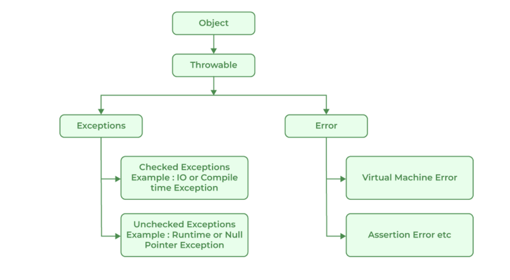
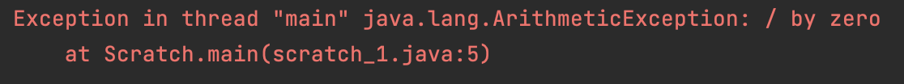
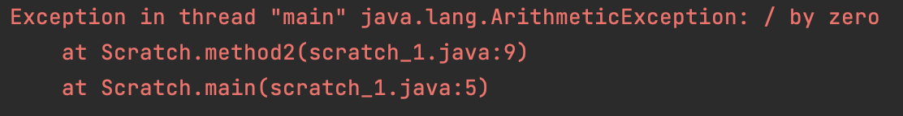

# Exception Handling

An exception is a runtime error.

## Fundamentals

* A java exception is object that describes the exceptional condition occurred in the code.
* When an exception occurs, that object is created and thrown to caller method.
* The caller method, will then decide to handle it or pass on.
* But, at some point, the exception is going to be caught and processed.
* The exceptions can be either generated by java runtime system, or we can also generate as per our use case.
* Exception handling in java is managed by five keywords: **try, catch, throw, throws** and **finally**.

## Exception Types



## Uncaught Exceptions

* Let's see an example,
```
class Scratch {
    public static void main(String[] args) {
        int numerator = 5;
        int denominator = 0;
        int result = numerator / denominator;
    }
}
```
* The above code will throw the following exception : 

* So, if we see the code has thrown an exception but we haven't written any code to handle it, so the exception got handled by default handler of java runtime system.
* The default handler will print the stack trace from the point where exception occurred and terminates the program.
* The print output may differ slightly based on the difference between JDKs.
* Example to show the stack trace based on multiple methods.
```
class Scratch {
    public static void main(String[] args) {
        int numerator = 5;
        int denominator = 0;
        method2(numerator, denominator);
    }

    public static void method2(int numerator, int denominator) {
        int result = numerator / denominator;
    }
}
```
* Output showing the trace of two methods:
